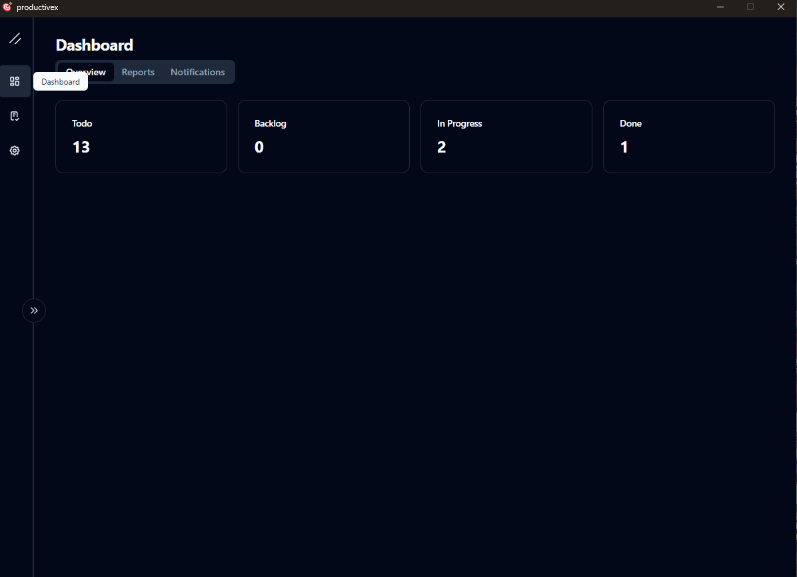
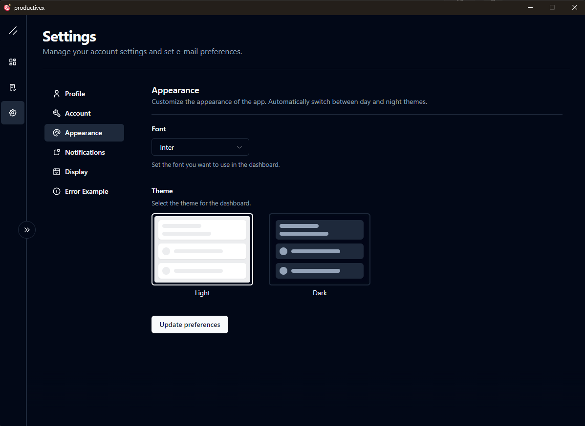
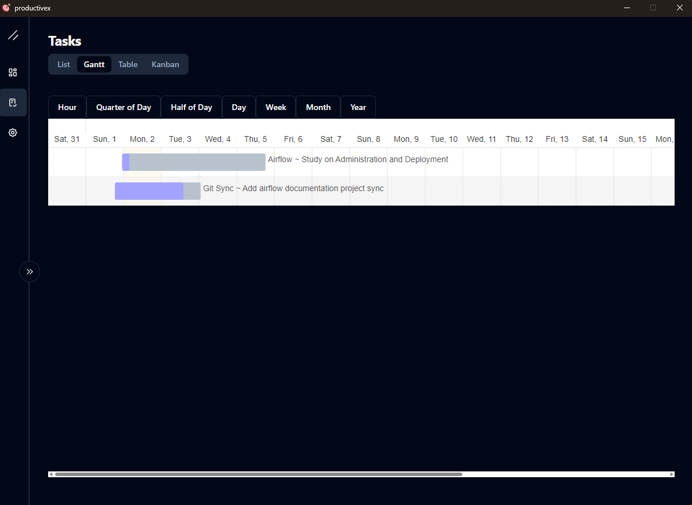
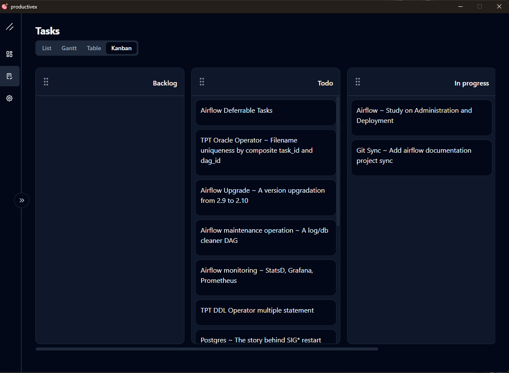
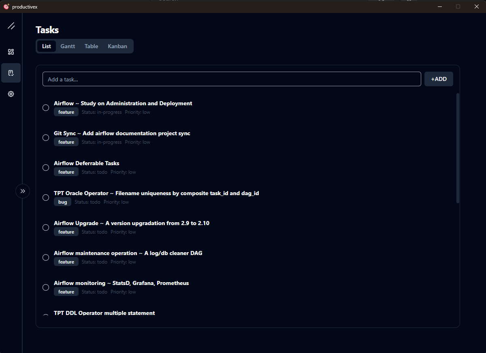
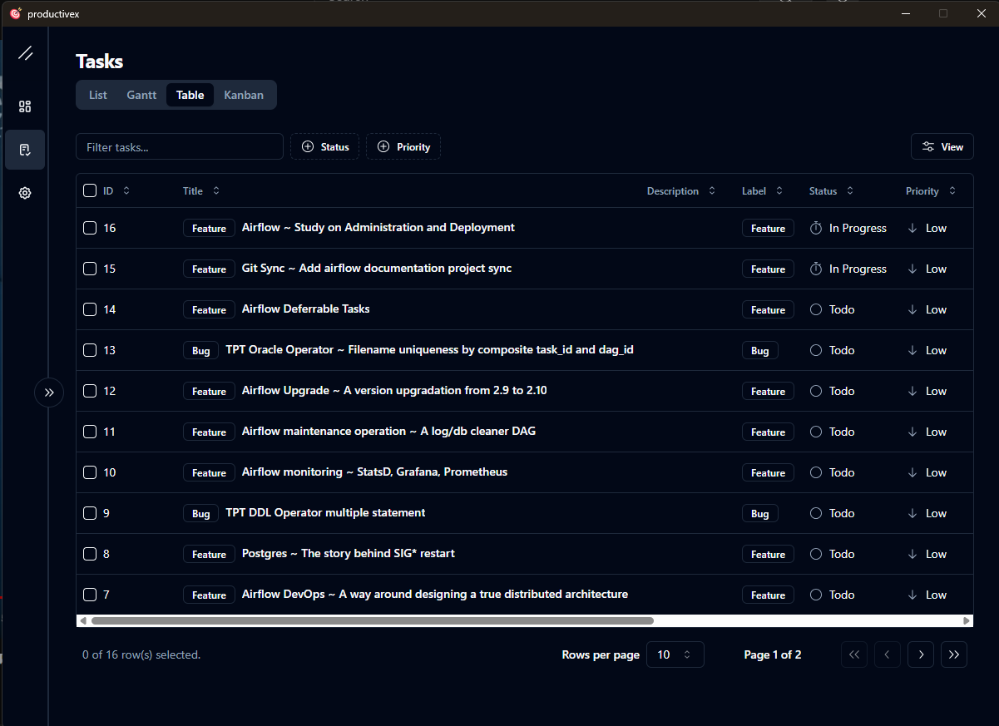

# ProductiveX

ProductiveX is a powerful and intuitive desktop application designed to enhance your productivity.

Features
- Task Management: Create, organize, and prioritize your tasks with ease.
- Time Tracking: Monitor how much time you spend on each task and project.
- Pomodoro Timer: Boost your focus and productivity with the built-in Pomodoro timer.
- Note-Taking: Jot down important notes and ideas without leaving the app.
- Calendar Integration: Sync your tasks and deadlines with your calendar.
- Analytics and Reporting: Gain insights into your productivity patterns with detailed reports.
Screenshots

## Screenshots

### Dashboard

### Settings

### Tasks Gantt View

### Tasks Kanban View

### Tasks List View

### Tasks Table View

# Tauri + React + Typescript

This template should help get you started developing with Tauri, React and Typescript in Vite.

## Recommended IDE Setup

- [VS Code](https://code.visualstudio.com/) + [Tauri](https://marketplace.visualstudio.com/items?itemName=tauri-apps.tauri-vscode) + [rust-analyzer](https://marketplace.visualstudio.com/items?itemName=rust-lang.rust-analyzer)
